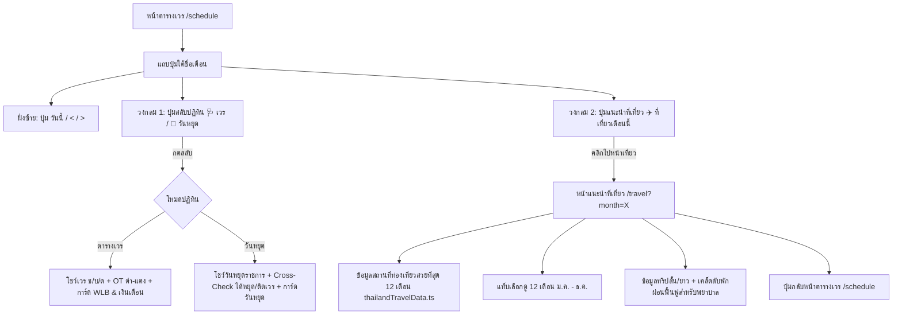

# แผนการพัฒนา: ปรับตำแหน่งปุ่มสลับปฏิทิน & เพิ่มหน้าสรุปแนะนำที่เที่ยวในประเทศไทยรายเดือน

เอกสารการออกแบบและวางแผนสำหรับ:
1. **ย้ายปุ่มสลับโหมดปฏิทิน** มาอยู่ตรงตำแหน่งที่วงไว้ในภาพ (แถวเดียวกับปุ่ม "วันนี้ / < / >" ทางฝั่งขวา)
2. **สร้างปุ่มและหน้าใหม่: "สรุปแนะนำที่เที่ยวในประเทศไทย ในแต่ละช่วงเดือน"** (Thailand Monthly Travel Guide for Nurses) เชื่อมโยงกับเดือนที่กำลังดูในปฏิทิน

---

## 📸 ภาพอ้างอิงและตำแหน่งปุ่ม (Visual Inspection from Screenshot)

จากภาพที่ผู้ใช้วงไว้ด้วยมาร์กเกอร์สีแดง:
- **แถวบน (Header Title)**: แสดงไอคอนคิตตี้, ชื่อเดือน "กันยายน 2569", ป้าย "ห้องคลอด LR", และคำบรรยาย "ตารางเวรพยาบาลห้องคลอด"
- **แถวล่าง (Navigation & Action Row)**:
  - **ฝั่งซ้าย**: ปุ่ม `[ วันนี้ ]`, `[ < ]`, `[ > ]`
  - **ฝั่งขวา (จุดที่วงไว้ 2 วง)**:
    - **วงกลมที่ 1 (ปุ่มซ้าย)**: ปุ่มกดสลับปฏิทิน (`[ 📅 วันหยุด ]` / `[ 🩺 ตารางเวร ]`)
    - **วงกลมที่ 2 (ปุ่มขวา)**: ปุ่มพาไปหน้าแนะนำที่เที่ยวประจำเดือน (`[ 🏖️ ที่เที่ยว ก.ย. ]` หรือ `[ ✈️ ที่เที่ยว ]`)

---

## 📋 ประเด็นที่ต้องการให้ผู้ใช้ตรวจสอบ (User Review & Audit)

> [!IMPORTANT]
> **1. การออกแบบปุ่มสลับปฏิทินตรงวงกลมที่ 1**:
> - ในโหมด **ตารางเวร (Shift View)**: ปุ่มจะแสดงเป็น `[ 📅 วันหยุด ]` (สีกุหลาบสดใส) แตะปุ๊บจะสลับไปหน้าปฏิทินวันหยุดทันที
> - ในโหมด **ปฏิทินวันหยุด (Holiday View)**: ปุ่มจะแสดงเป็น `[ 🩺 ตารางเวร ]` (สีชมพูคิตตี้) แตะปุ๊บจะสลับกลับมาหน้าเวรทันที
> - รองรับการกดสลับไปมาได้อย่างรวดเร็วในจุดเดียว และจำค่าใน `localStorage`
>
> **2. การออกแบบปุ่มแนะนำที่เที่ยวตรงวงกลมที่ 2**:
> - แสดงเป็นปุ่มน่ารักสดใส: `[ ✈️ ที่เที่ยว ก.ย. ]` (ชื่อเดือนจะเปลี่ยนตามเดือนที่กำลังเปิดปฏิทินอยู่ เช่น ถ้าดูเดือน ต.ค. ก็จะขึ้น `[ ✈️ ที่เที่ยว ต.ค. ]`)
> - เมื่อคลิก จะเปิดไปยังหน้า **`/travel?month=9`** เพื่อพาไปดูสถานที่ท่องเที่ยวที่สวยที่สุดในเดือนนั้นทันที
>
> **3. หน้าสรุปแนะนำที่เที่ยวประเทศไทยรายเดือน (`/travel`)**:
> - ออกแบบเป็นหน้ารวมที่เที่ยว 12 เดือน ครอบคลุมทั่วไทย (เหนือ, กลาง, อีสาน, ใต้, ตะวันออก)
> - **สำหรับพยาบาลโดยเฉพาะ**:
>   - มีระบุ **ความยาวทริป** (เช่น "ทริปสั้น 1-2 วัน สำหรับวันหยุด OFF สั้น" หรือ "ทริป 3-4 วัน สำหรับวันหยุดยาว/ลาพักร้อน")
>   - มี **Nurse Travel Tips** (แนะนำการพักผ่อนฟื้นฟูพลังกายใจหลังลงเวรดึก/เวรหนัก)
>   - แถบเมนูกดเลือกเปลี่ยนดูได้ทั้ง 12 เดือน (ม.ค. - ธ.ค.) อย่างลื่นไหล
>   - ปุ่ม **`[ ← กลับตารางเวร ]`** ที่ด้านบนและล่าง เพื่อกลับมาหน้าจัดตารางเวรได้สะดวก 100%

---

## 🔍 Audit Notes (Claude — เช็คเทียบโค้ดจริง + Next.js 16)

> **Scope:** display-only ล้วน ไม่มี schema/DB/calc (เหมือนฟีเจอร์วันหยุด) — ข้อมูลที่เที่ยว static, ไม่ป้อนค่าเข้าเงิน/เวร. ไม่ต้อง `prisma db push` แต่ build ต้องเขียว

### 🔴 Next.js 16 gotchas (AGENTS.md: "This is NOT the Next.js you know")
1. **`searchParams` เป็น Promise ต้อง `await`**: `/travel` เป็น**หน้าแรกในโปรเจกต์ที่อ่าน query param** — Next 16 หน้า server ต้องรับ `searchParams: Promise<{ month?: string }>` แล้ว `await` (pattern เดียวกับ `patient/[id]/report/page.tsx` ที่ใช้ `params: Promise<{id}>` + `await params` — ดูของจริงในไฟล์นั้น). **แนะนำ:** `travel/page.tsx` (server) `await searchParams` → validate เดือน → ส่ง `initialMonth` เป็น prop ให้ `TravelClient`. **อย่า**ใช้ `useSearchParams()` ลอยๆ ใน client — ถ้าใช้ต้องครอบ `<Suspense>` ไม่งั้น build พัง (CSR bailout)
2. **รูป external + `next/image`**: `next.config.ts` ตอนนี้ **ว่าง ไม่มี `images.remotePatterns`** ⇒ ใช้ `<Image>` กับ URL นอกโดเมน = **build/runtime error ทันที**. เลือก: (แนะนำ) `` ธรรมดา + skeleton + gradient fallback (ไม่แตะ next.config), หรือถ้าจะใช้ `next/image` ต้องเพิ่ม `images.remotePatterns` ให้ครบทุกโดเมน

### 🔴 ลิขสิทธิ์รูปภาพ
3. **ห้าม hotlink รูปถ่ายความละเอียดสูงมั่วๆ จากเว็บ/สต็อกที่มีลิขสิทธิ์** (แผนเขียน "ลิงก์รูปภาพถ่ายสถานที่จริง") — เสี่ยงลิขสิทธิ์ + ลิงก์ตาย/โดนบล็อก hotlink. ใช้เฉพาะแหล่ง **CC0/มีสิทธิ์** (Unsplash/Wikimedia + attribution) หรือรูปเล็ก bundle ในโปรเจกต์. **ให้ `imageFallback` (gradient + emoji) เป็นค่าหลักที่ดูดีแม้ไม่มีรูป** รูปจริงเป็นของเสริม

### 🟡 ปรับให้เนียน
4. **`month` param validate + default**: ไม่มี/เพี้ยน (`?month=99`) → default เดือนปัจจุบัน (client Asia/Bangkok ใช้ local ได้) + clamp 1–12 กัน crash
5. **แถว nav แน่นบนมือถือ**: แถว 2 มี `[วันนี้][<][>]` (flex-wrap, 375px) เพิ่มอีก 2 ปุ่มเสี่ยงล้น ⇒ มือถือใช้ icon-first/ย่อข้อความ + **ทดสอบ 375px จริง**. ปุ่ม toggle ที่ย้ายมาต้องใช้ `calendarMode`/`localStorage 'lr_calendar_mode'` เดิมใน ShiftCalendar **ไม่สร้าง state ซ้ำ**
6. **เนื้อหาที่เที่ยว = soft content** ไม่ต้อง verify แหล่งทางการ (ต่างจากวันหยุด) แต่เลี่ยงเคลมตายตัวเรื่องฤดู/เปิด-ปิด (อ่าวมาหยา/ภูกระดึงมีช่วงปิด) — เขียนเป็น "ช่วงแนะนำ"
7. ปุ่ม `← กลับตารางเวร` ใช้ `next/link` → `/schedule` (localStorage จำโหมดปฏิทินไว้แล้ว)

## 🏗️ โครงสร้างสถาปัตยกรรมและไฟล์ที่เกี่ยวข้อง

---

## 📁 แผนการเพิ่มและแก้ไขไฟล์ (Proposed Changes)

### 1. ไฟล์ฐานข้อมูลสถานที่ท่องเที่ยวรายเดือน (`src/app/utils/thailandTravelData.ts`) [สร้างใหม่]
สร้างข้อมูลสถานที่ท่องเที่ยวของประเทศไทยแบบเจาะลึก 12 เดือน โดยเน้นช่วงเวลาและฤดูกาลที่ดีที่สุด:
- **มกราคม**: ภูลมโล (ซากุระเมืองไทย ดอกพญาเสือโคร่ง), ดอยอ่างขาง/อินทนนท์ (สัมผัสเหมยขาบ), เกาะหลีเป๊ะ (อันดามันน้ำใส)
- **กุมภาพันธ์**: เชียงราย ดอยแม่สลอง (จิบชา ดอกไม้เมืองหนาว), ทุ่งบัวแดง อุดรธานี, หมู่เกาะสิมิลัน พังงา
- **มีนาคม**: เกาะกูด/เกาะช้าง ตราด (คลื่นลมสงบ หาดทรายขาว), สามพันโบก อุบลราชธานี, อ่าวมาหยา กระบี่
- **เมษายน**: เทศกาลสงกรานต์เชียงใหม่/กทม., เกาะเสม็ด ระยอง, เกาะล้าน ชลบุรี (ทริปใกล้กรุงสำหรับวันหยุดสั้น)
- **พฤษภาคม**: สวนผลไม้ระยอง-จันทบุรี (บุฟเฟต์ทุเรียน มังคุด), เกาะสมุย เกาะเต่า (ทะเลอ่าวไทยน้ำใส)
- **มิถุนายน**: เขาค้อ-ภูทับเบิก (ทะเลหมอกหน้าฝนสุดสดชื่น), หมู่บ้านอีต่อง ปิล็อก กาญจนบุรี
- **กรกฎาคม**: ทุ่งดอกกระเจียว อุทยานฯ ป่าหินงาม ชัยภูมิ, เขาใหญ่-วังน้ำเขียว โอโซนบริสุทธิ์
- **สิงหาคม**: นาขั้นบันไดป่าบงเปียง เชียงใหม่ (ทุ่งนาเขียวขจี), ปัว-บ่อเกลือ น่าน, น้ำตกทีลอซู ตาก
- **กันยายน**: ทะเลหมอกภูทับเบิก (หนาแน่นที่สุดช่วงปลายฝน), ลานหินปุ่ม ภูหินร่องกล้า, เขาช่องลม นครนายก
- **ตุลาคม**: ภูกระดึง จ.เลย (เปิดฤดูเดินป่า รับลมหนาว), เชียงคาน ริมแม่น้ำโขง, ภูเรือ
- **พฤศจิกายน**: ทุ่งดอกบัวตอง ดอยแม่อูคอ แม่ฮ่องสอน, ประเพณียี่เป็ง เชียงใหม่ / ลอยกระทงสุโขทัย
- **ธันวาคม**: ดอยอินทนนท์ กิ่วแม่ปาน เชียงใหม่, เขาค้อ เพชรบูรณ์, ดอยเสมอดาว น่าน, สวนผึ้ง ราชบุรี

แต่ละสถานที่จะมี:
- `id`, `name`, `province`, `region` (เหนือ, กลาง, อีสาน, ใต้, ตะวันออก)
- `imageUrl` (**ทางเลือก** — เฉพาะแหล่ง CC0/มีสิทธิ์ใช้ + attribution ห้าม hotlink ภาพลิขสิทธิ์ ดู Audit #3)
- `imageFallback` (Gradient สีพาสเทล + Emoji) — **ค่าหลักที่ต้องดูดีแม้ไม่มี `imageUrl`** ไม่ใช่แค่ "เผื่อเน็ตช้า"
- `highlight` (จุดเด่นไฮไลท์ที่ไม่ควรพลาด)
- `tripDuration` (1-2 วัน หรือ 3-4 วัน)
- `nurseTip` (คำแนะนำเพื่อการผ่อนคลายและฟื้นฟูสุขภาพสำหรับพยาบาล)
- `bestTime` (ช่วงเวลาแนะนำในเดือน)
- `tag` (เช่น "❄️ ลมหนาว", "🌊 น้ำใส", "🍃 ธรรมชาติ")

### 📸 การออกแบบการ์ดรูปภาพสถานที่ (Visual Travel Card UI)
- **รูปภาพหัวการ์ด (Photo Header)**: สัดส่วน Aspect Ratio 16:9 หรือ 4:3 คมชัด สวยงามสบายตา
- **ป้ายกำกับบนภาพ (Image Overlay Badges)**:
  - มุมซ้ายบน: ป้ายบอกจังหวัดและภูมิภาค (เช่น `📍 เพชรบูรณ์ • ภาคเหนือ`)
  - มุมขวาบน: ป้ายความยาวทริป (เช่น `⏱️ 2 วัน 1 คืน` เหมาะกับคนหยุดสั้น)
- **ระบบโหลดภาพแบบ Responsive & Lazy Loading**: โหลดเร็ว ไม่เปลืองเน็ต มี Skeleton shimmer สวยงามขณะโหลด และมี Fallback ถ้าโหลดภาพไม่สำเร็จ

### 2. ปรับปรุงคอมโพเนนต์ปฏิทิน (`src/app/components/ShiftCalendar.tsx`) [แก้ไข]
- ย้ายปุ่มสลับโหมดปฏิทิน และเพิ่มปุ่มท่องเที่ยวในแถวที่ 2 ตรงกับจุดที่ผู้ใช้วงไว้ในภาพ:
  - ฝั่งซ้าย: `[วันนี้]` `[<]` `[>]`
  - ฝั่งขวา:
    - วงกลม 1: ปุ่มสลับปฏิทิน `[ 📅 วันหยุด ]` หรือ `[ 🩺 ตารางเวร ]`
    - วงกลม 2: ปุ่มแนะนำที่เที่ยว `[ ✈️ ที่เที่ยว ก.ย. ]` เชื่อมโยงไปยัง `/travel?month=${currentMonth}`

### 3. หน้าแนะนำสถานที่ท่องเที่ยวประจำเดือน (`src/app/travel/page.tsx` & `src/app/travel/TravelClient.tsx`) [สร้างใหม่]
- `page.tsx` = **server component**: รับ `searchParams: Promise<{ month?: string }>` → `await` → validate/clamp เป็น 1–12 (ไม่มี/เพี้ยน = เดือนปัจจุบัน) → ส่ง `initialMonth` prop ให้ `TravelClient` (client) — **ไม่ใช้ `useSearchParams` ลอยๆ** (Audit #1). ไม่มี DB จึงไม่ต้อง `force-dynamic`
- หน้ารองรับ URL parameter `?month=1..12` (เช่น เข้ามาจากกันยายน ก็จะแสดงกันยายนทันท่วงที)
- แถบ Tab เลือกเปลี่ยนเดือนด้านบน (ม.ค. - ธ.ค.) พร้อมระบุเทศกาลประจำเดือน
- การ์ดสถานที่ท่องเที่ยวดีไซน์น่ารัก ธีมพาสเทล Hello Kitty เข้ากับบรรยากาศแอป
- ป้ายบอกระยะเวลาทริป (1-2 วัน / 3-4 วัน) ช่วยให้พยาบาลที่ดูตารางเวร OFF ตัดสินใจวางแผนได้ทันที
- ปุ่ม `[ ← กลับไปตารางเวร ]` เด่นชัดด้านบนและล่าง

---

## 🧪 แผนการทดสอบ (Verification Plan)

1. **ทดสอบตำแหน่งปุ่มตรงตามรูปภาพ 100%**:
   - เปิดหน้า `/schedule` บนหน้าจอ Mobile (เทียบกับภาพ `media_1788858216023.png`)
   - ตรวจสอบว่าปุ่มสลับปฏิทิน และปุ่มแนะนำที่เที่ยว อยู่ฝั่งขวาของปุ่ม `[วันนี้] [<] [>]` พอดี และไม่ล้นหรือเบียดหน้าจอ
2. **ทดสอบปุ่มสลับปฏิทิน (วงกลมที่ 1)**:
   - กดสลับจาก ตารางเวร → ปฏิทินวันหยุด (ไฮไลท์วันหยุด, แสดง Cross-Check "ได้หยุด/ติดเวร")
   - กดสลับกลับ ปฏิทินวันหยุด → ตารางเวร (แสดงเวร ช, บ, ด, สี OT ดำ-แดง, สถิติ WLB และเงินเดือน)
   - รีเฟรชหน้าเว็บ ตรวจสอบการจำค่าใน `localStorage`
3. **ทดสอบปุ่มแนะนำที่เที่ยว (วงกลมที่ 2)**:
   - ขณะอยู่หน้าเดือนกันยายน กดปุ่ม `[ ✈️ ที่เที่ยว ก.ย. ]` → นำทางไปที่ `/travel?month=9`
   - หน้า `/travel` แสดงสถานที่ท่องเที่ยวเดือนกันยายน (เช่น ทะเลหมอกภูทับเบิก, นาขั้นบันไดป่าบงเปียง)
   - ลองแตะเปลี่ยนเดือนอื่นๆ (เช่น เม.ย. เทศกาลสงกรานต์, ธ.ค. ดอยอินทนนท์ กิ่วแม่ปาน)
   - กดปุ่ม `[ ← กลับตารางเวร ]` → ย้อนกลับมาที่หน้าปฏิทินเวรอย่างถูกต้อง
4. **ทดสอบ month param แปลกๆ**: เข้า `/travel` (ไม่มี param), `/travel?month=99`, `/travel?month=abc` → ต้อง default เป็นเดือนปัจจุบัน ไม่ crash/ไม่ขาว
5. **Responsive 375px**: เปิด `/schedule` ที่กว้าง 375px เทียบภาพจริง — แถว nav (`[วันนี้][<][>]` + toggle + ที่เที่ยว) ต้องไม่ล้น/ตัดบรรทัดน่าเกลียด
6. **Build Verification**:
   - `npm run build` ผ่าน 0 errors — **โดยเฉพาะดูว่าไม่มี error เรื่อง `searchParams` เป็น Promise หรือ `useSearchParams` ต้องมี Suspense** (Next 16) และถ้าใช้ `next/image` remote ต้องไม่ error เรื่อง `remotePatterns`
   - ฟีเจอร์นี้ไม่แตะ schema ⇒ ไม่ต้อง db push แต่เช็ค **Vercel Deployments เขียว** หลัง deploy
